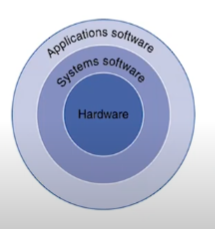
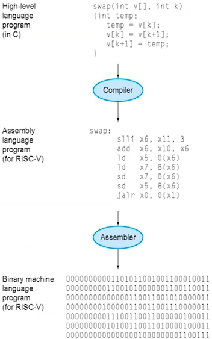

# 추상화 및 컴퓨터 하드웨어 기술

## 추상화 (Abstraction)

- 두 인접한 레이어에서 필요한 인터페이스 정보만 남기는 것
- 중요도가 낮은 사항은 숨기는 것

## 컴퓨터 구성 요소

- 응용 소프트웨어 (Application software)
  - 고급 프로그래밍 언어 (High-Level Language)로 작성됨
  - C, Python, 한글, 워드 etc..
- 시스템 소트프웨어 (System software)
  - 컴파일러 (Compiler)
    - HLL을 기계어로 번역
  -  운영 체제 (Operating system)
    - 서비스어
    - input / ouput을 조절
    - 메모리와 저장공간 관리
    - 작업 스케줄링 및 리소스 공유

- 하드웨어 (Hardware)
  - 프로세서, 메모리, I/O Controllers

### 고급 프로그래밍 언어 (High-Level Language)

- Problem Domain과 비슷한 추상화 수준
- 생산성과 휴대성 제공

### 어셈블리어 (Assembly Language)

- Textual representation of instructions

### Hardware representation

- 이진법 (Binary digits, bits)
- 명령어와 데이터를 암호화

## 하드웨어 구성 요소

- CPU
  - 중앙처리 장치
  - 주기억 장치에서 프로그램 명령어와 데이터를 읽어 처리하고 명령어의 수행 순서 제어
  - 산술논리연산장치 (Arithmetic and Logic Unit)
    - 비교, 연산 담당
  - 제어장치 (Control)
    - 명령어 해석과 실행 담당
  - 레지스터 (Register)
    - 속도가 빠른 데이터 기억장소
- 메모리
  - 주기억 장치
    - 실행중인 프로그램에 필요한 데이터 일시 저장
  - 보조기억 장치
    - 속도는 비교적 느리나 자료 영구 보관
    - 하드디스크 등

- 입출력 장치
  - 입력 장치
    - 디스플레이, 키보드, 마우스 등
  - 출력 장치
    - 프린터, 모니터, 스피커 등

## 기술 경향

- 용량과 성능 증가
- 비용 감소

## 반도체 기술 (Semiconductor Technology)

- 실리콘 : 반도체
- 전도체, 단열재, 스위치로 구성