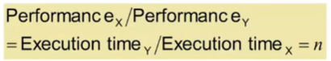

# 컴퓨터 성능

- 반응 시간
  - 처리 시간
- 높은 처리량
- 컴퓨터 리소스 적게 이용
- 컴퓨터 시스템이나 응용 프로그램의 높은 이용

### 성능을 결정하는 요소

- 알고리즘 (Algorithm)
  - 실행될 작업의 수 결정
- 프로그래밍 언어, 컴파일러, 구조
  - 작업당 실행될 기계 명령어의 수 결정
- 프로세서와 메모리 시스템
  - 명령어의 수행 속도 결정
- I/O 시스템 (OS 포함)
  - 입출력 작업의 수행 속도 결정

### 상대 성능

- 성능 = 1 / 실행 시간
- 'X가 Y보다 n배 빠르다'

### 경과 시간

- 시스템 성능을 결정
- 프로세싱, I/O, OS 오버헤드, 유휴 시간을 포함한 시간

### CPU 시간

- CPU Clock cycles * Clock cycle time = CPU Clock Cycles / Clock Rate
  - clock cyle 수 감소
  - clock rate 증가
- Clock Cycles = Introduction Count * Cycles per Instruction
- CPU Time = Instruction Count * CPI * Clock Cycle Time = Instruction Count * CPI / Clock Rate

- 주어진 작업을 프로세싱하는데 걸리는 시간
  - I/O 시간, 다른 작업 공유 시간은 제외
- 유저 CPU 시간와 시스템 CPU 시간으로 구성
- CPU와 시스템 성능에 의해 좌우됨