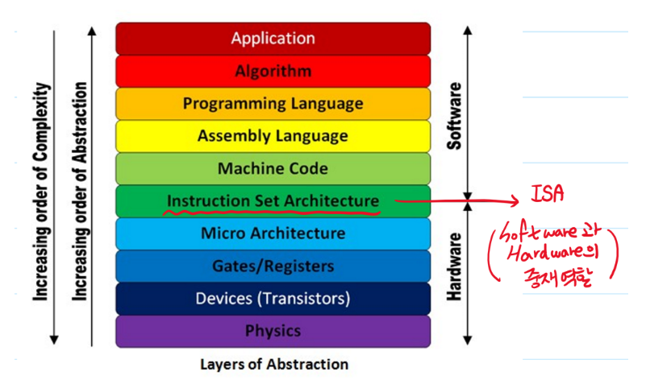

# Instruction Set Architecture (ISA)

- 마이크로 프로세서가 인식해서 기능을 이해하고 실행할 수 있는 명령어 집합 구조
  - 자료형, 명령어, 레지스터, 어드레싱 모드, 메모리 구조, 인터럽트, 예외 처리, 외부 입출력 등

- 소트프웨어와 하드웨어 사이의 중재자 역할

### 개요

- 성능 / 에너지와는 무관
- 소프트웨어 개발 / 스택과 연관
- 무료 공개된 ISA에 대한 표준 필요

### 대표적인 ISA들

- x86 ISA

  - 너무 복잡한 명령어 세트
  - 유료

- ARM ISA

  - 보다 간단한 명령어 세트
  - 유료

- RISC-V ISA

  - 미국 UC 버클리에서 개발중인 무료 오픈 소스 명령어셋 아키텍쳐

  - 다른 상업적인 ISA보다 간단함
  - 스마트폰이나 임베디드 장치의 CPU로 널리 쓰이는 ARM과 경쟁하고 대체할 수 있는 고성능의 자유 CPU 구조를 개발하는 것이 목표
  - 연구 / 교육/ 상업적 목적으로 설계됨

### 4개의 정수 ISA

- RV32E, RV32I, RV64I, RV128I

### 표준 익스텐션

- M : 정수 곱/ 나눗셈
- A : atomic memory operations
- F : 단일-정밀도 부동소수점
- D : 배수-정밀도 부동소수점
- G = IMAFD, '범용' ISA
- Q : 4배수정밀도 부동소수점

### RISC-V ISA