### 학습목표

> 프로그램이 기계어로 바뀌는 과정 / 하드웨어가 실행하는 과정
>
> 하드웨어 / 소프트웨어 인터페이스
>
> 프로그램 성능의 정의
>
> 하드웨어 디자이너가 성능 향상을 시키는 법

## 컴퓨터 발전

- 무어의 법칙
  - 하나의 칩에 들어가는 트랜지스터 수는 매 2년 마다 두 배씩 증가할 것이라 예언

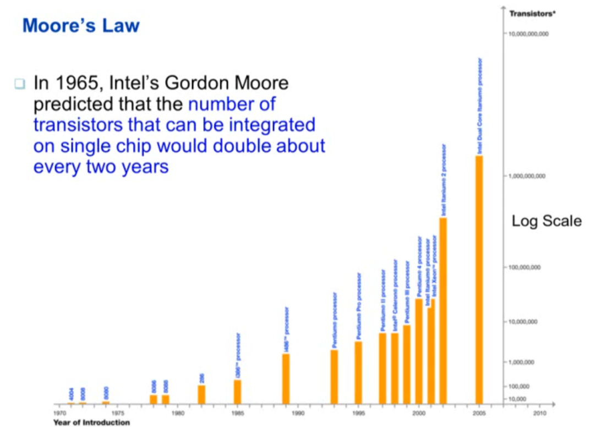

- 기술 발전의 가장 큰 원동력
- 새로운 어플리케이션들을 실현 시킴
  - 자동차 내부 컴퓨터, 휴대폰, 인간 게놈 프로젝트, WWW, 검색 엔진 등..

## 컴퓨터의 종류

- Personal Computers
  - 일반적인 용도
  - 가성비 / 성능에 민감
- Server Computers
  - 네트워크 기반
  - 고 용량, 고성능, 높은 신뢰성

- Supercomputers
  -  고가, 전력 소모 큼
  - 최첨단의 과학적, 공학적 계산을 목적으로 사용하는 특수 컴퓨터
- Embedded computers
  - 시스템의 숨은 구성 요소
  - 적은 전력 소모, 저성능, 저비용

## 기본 단위

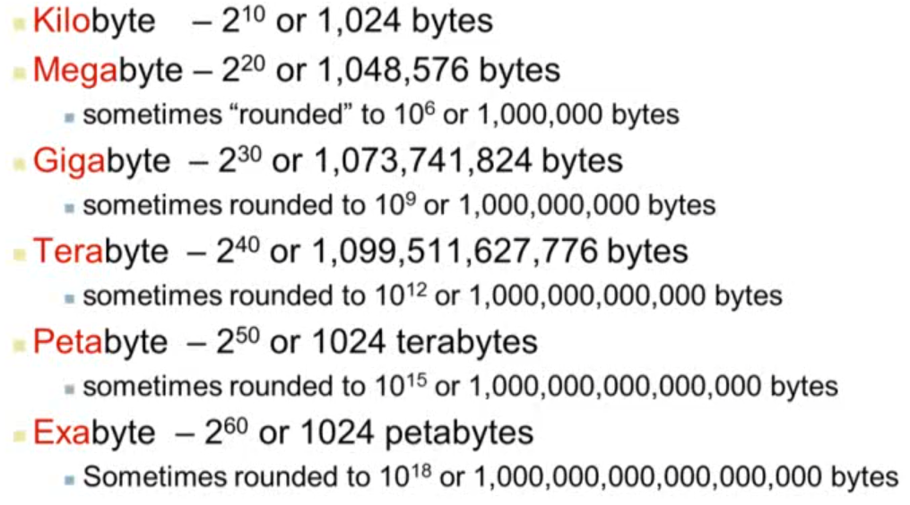

## PostPC 시대

- Personal Mobile Device (PMD)
  - 배터리로 동작
  - 인터넷에 연결
  - 스마트폰, 태블릿, 전자 안경 등
- Cloud computing
  - Warehouse Scale Computers (WSC)
    - 하나의 서버에서 특정 데이터를 처리
  - Software as a Service (SaaS)
  - 단순한 기능 - PMD / 복잡한 기능 - Cloud
  - 아마존, 구글 등

## 성능

- 알고리즘
  - 처리될 작업의 수를 결정
- 프로그래밍 언어, 컴파일러, 구조
  - 작업당 처리될 기계명령어의 수를 결정
- 프로세서와 메모리 시스템
  - 명령어의 처리 속도를 결정
- I/O 시스템
  - 입출력 작업의 실행 속도를 결정

## 8가지 위대한 컴퓨터 구조 아이디어

- 무어의 법칙
- 추상화 (abstraction)
- 공통된 작업의 속도 향상
- parallelism을 통한 성능 향상
- 파이프라이닝을 통한 성능 향상
- 예측을 통한 성능 향상
- 메모리 계층 구조
- 중복을 통한 신뢰성 향상

## 프로그램이란

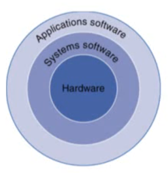

- 응용 소프트웨어 (Application software)
  - 고급 언어로 작성
- 시스템 소프트웨어 (System software)
  - 컴파일러
    - 고급 언어를 기계 언어로 변환
  - 운영 체제
    - 입출력을 조정
    - 메모리와 저장공간 관리
    - 스케줄링 작업 & 자원 공유
- 하드웨어 (Hardware)
  - 프로세서, 메모리, I/O 컨트롤러

## 프로그램 코드의 단계

- 고급 언어
  - 생산성과 편의성 제공
  - 컴파일러가 어셈블리어로 변환
- 어셈블리어
  - 명령어의 원문적 표현
  - 어셈블러가 바이너리 코드로 변환
- 하드웨어 표현
  - 이진법
  - 명령어와 데이터를 표현

## 컴퓨터의 구성 요소

- 모든 종류의 동일한 구성 요소를 지님
  - 데스크탑, 서버, 임베디드
- 입출력 시스템
  - UI 장치
    - 디스플레이, 키보드, 마우스
  - 저장 공간
    - 하드디스크, CD/DVD
  - 네트웨크 어댑터
    - 다른 컴퓨터와 통신

## 프로세서 내부

- 데이터 경로 
  - 데이터의 작업을 수행
- 컨트롤
  - 연속된 데이터 경로, 메모리
- 캐시 메모리
  - 데이터에 즉각적인 접근을 하게 해주는 작고 빠른 SRAM 메모리

## 추상화 (Abstraction)

- 낮은 단계 세부사항을 숨겨 복잡한 문제 해결시 도움
- 명령어 집합 구조 (Instruction Set Architecture)
  - 하드웨어/소프트웨어 인터페이스
- 응용 프로그램 이진 인터페이스 (Application binary interface)
  - ISA + 시스템 소프트웨어 인터페이스
- 실행
  - 세부 사항과 인터페이스

## 저장공간

- 휘발성 주 기억 장치
  - DRAM
  - 전원이 꺼지면 명령어와 데이터 소실
- 비휘발성 보조 기억 장치
  - 자기디스크, 플래시메모리, 광 디스크 (CDROM, DVD)

## 네트워크

- Local Area Network (LAN) : 이더넷
- Wide Area Network (WAN) : 인터넷
- Wireless network : 와이파이, 블루투스

## 기술 동향

- 향상된 용량과 성능
- 저비용
- 성능 대비 비용이 급격히 증가함

# 성능

- 반응 시간
  - 작업을 수행하는데 걸리는 시간
- 처리량
  - 단위 시간당 처리할 수 있는 일의 양

## 상대 성능

- 성능 = 1 / 실행 시간

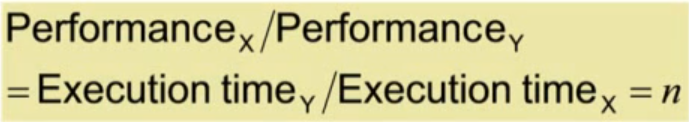

## 실행 시간 측정

- 경과 시간
  - 총 반응 시간
    - 프로세싱, I/O, OS overhead, 유휴 시간
  - 시스템 성능을 결정
- CPU 시간
  - 주어진 작업을 수행하는데 걸린 시간
    - I/O 시간, 다른 작업 시간을 제외
  - 유저 CPU 시간 / 시스템 CPU 시간으로 구분
  - 프로그램에 따라 CPU 또는 시스템 성능에 의해 영향을 받음

## CPU Clocking

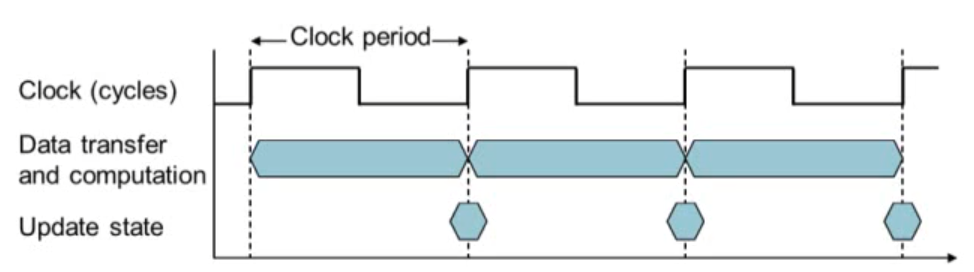

- 클록 주기 : 단위 클록 사이클의 시간 (ps)
- 클록 주파수(속도) : 초당 사이클 수 (Hz)

- 클록 주기 = 1 / 클록 속도

## CPU 시간

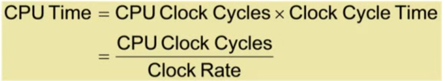

- 성능을 향상시키기 위해선?
  - 클록 사이클 감소
  - 클록 속도 증가
  - 클록 속도와 사이클 수의 균형을 잘 조절해야함

## 명령어 수와 Cycles Per Instruction (CPI)

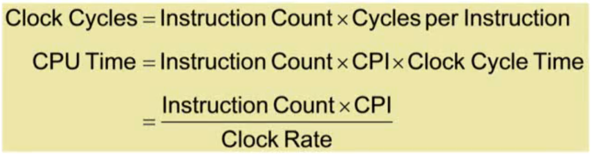

- 프로그램의 명령어 수
  - 프로그램, ISA, 컴파일러가 결정
- 명령어당 평균 사이클
  - CPU 하드웨어가 결정
  - 다양한 명령어에 따라 CPI가 달라진다면 혼합 비율에 따른 평균 CPI를 사용

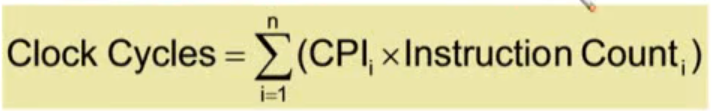

- CPI 가중 평균

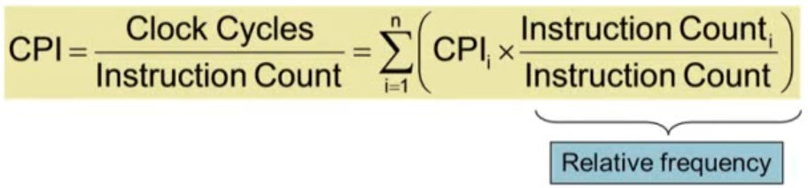

## 요약

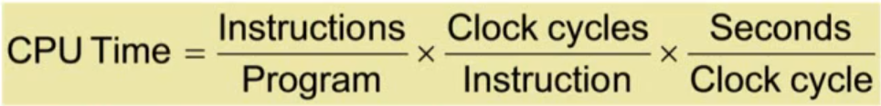

- 성능을 결정하는 4가지 요소
  1. 알고리즘
     - 명령어 수, 명령어당 사이클에 영향을 줌
  2.  프로그래밍 언어
     - 명령어 수, 명령어당 사이클에 영향을 줌
  3. 컴파일러
     - 명령어 수, 명령어당 사이클에 영향을 줌
  4. 명령어 집합 구조
     - 명령어 수, 명령어당 사이클, 클록 사이클 시간에 영향을 줌

## Power wall

- 소비 전력을 높이면 열이 올라 성능이 떨어지고, 
- 소비 전력을 낮추면 클록 속도가 느려짐
- 소비 전력과 냉각의 균형을 잘 맞춰주어야함

- **멀티 코어**를 통해 성능 향상을 도모함

#### 단일 프로세서의 성능

- 전력, 명령어단계 병렬성, 메모리 지연으로 인해 성능이 제한됨

### 멀티 프로세서의 도입

- 멀티코어 마이크로프로세서
  - 한 칩당 여러 개의 프로세서
- **명시적 병렬 프로그래밍**을 필요로 함
  - 명령 단계 병렬성과는 다름
    - 하드웨어가 동시에 여러 개의 명령 실행
    - 프로그래머가 고려하지 않아도 동작
  - 과제
    - 프로그래머가 일일히 고려해줘야 함
    - 부하의 균형
    - 통신과 동기화의 최적화

## SPEC CPU Benchmark

> Standard Performance Evaluation Corp
>
> ​	CPU, I/O, Web 등의 성능을 측정하는 벤치마크를 만드는 회사

- CPU를 평가하는 벤치마크

#### SPEC CPU 2006

- 여러 프로그램을 실행하는 데 걸린 지연 시간을 측정
  - I/O 시간은 너무 작아 무시하고, CPU 성능에 집중
- 참조 머신과 비교하여 성능 향상 측정
- CINT2006 (정수형)과 CFP2006(부동소숫점형)으로 성능비를 기하 평균냄

## 결론

- 가격 대비 성능은 향상중
- 추상화의 계층 구조
  - 하드웨어와 소프트웨어
- 명령어 집합 구조
  - 하드웨어/소프트웨어 인터페이스
- 실행 시간
  - 최고의 성능 측정법
- 전력이 제약 요소
  - 성능을 향상 시키기 위해 병렬 사용

## 논리적 오류와 위험

### 위험 : Amdahl의 법칙

- 컴퓨터 부분의 성능 향상과 전체 성능의 전반적인 향상은 비례한다

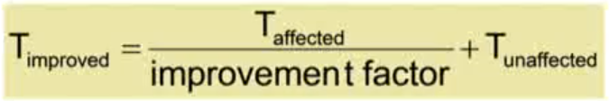

- T_affected : 성능을 향상 시키고자 하는 부분
- T_unaffected :  그 나머지

- T_improved : 성능 향상 후 시간

### 위험 : 성능 단위로서의 MIPS

- Millions of Instructions Per Second
- 컴퓨터마다 다른 ISA를 지님
- 명령어마다 다른 복잡성을 지님

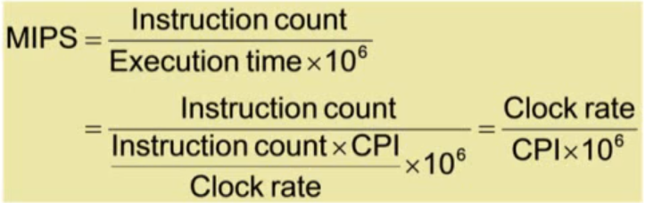

- CPI에 의해 좌우됨
  - CPU마다 CPI가 다르기 때문에 정확하지 않음

### 논리적 오류 : 유휴에서 낮은 전력

- 프로세서 설계시 부하에 비례한 전력 소모를 고려해야 함