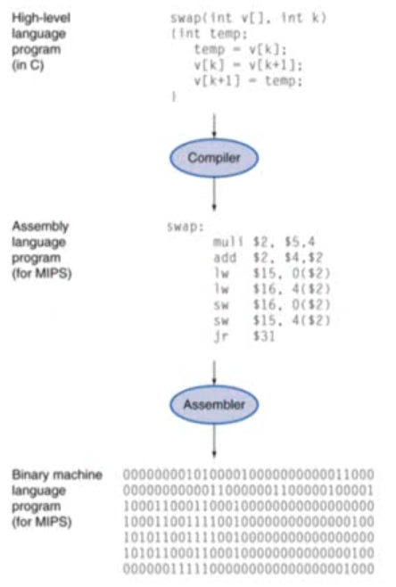

### 학습목표

> 프로그램이 기계어로 바뀌는 과정 / 하드웨어가 실행하는 과정
>
> 하드웨어 / 소프트웨어 인터페이스
>
> 프로그램 성능의 정의
>
> 하드웨어 디자이너가 성능 향상을 시키는 법

## 컴퓨터 발전

- 무어의 법칙
  - 하나의 칩에 들어가는 트랜지스터 수는 매 2년 마다 두 배씩 증가할 것이라 예언

- 기술 발전의 가장 큰 원동력
- 새로운 어플리케이션들을 실현 시킴
  - 자동차 내부 컴퓨터, 휴대폰, 인간 게놈 프로젝트, WWW, 검색 엔진 등..

## 컴퓨터의 종류

- Personal Computers
  - 일반적인 용도
  - 가성비 / 성능에 민감
- Server Computers
  - 네트워크 기반
  - 고 용량, 고성능, 높은 신뢰성

- Supercomputers
  -  고가, 전력 소모 큼
  - 최첨단의 과학적, 공학적 계산을 목적으로 사용하는 특수 컴퓨터
- Embedded computers
  - 시스템의 숨은 구성 요소
  - 적은 전력 소모, 저성능, 저비용

## 기본 단위

## PostPC 시대

- Personal Mobile Device (PMD)
  - 배터리로 동작
  - 인터넷에 연결
  - 스마트폰, 태블릿, 전자 안경 등
- Cloud computing
  - Warehouse Scale Computers (WSC)
    - 하나의 서버에서 특정 데이터를 처리
  - Software as a Service (SaaS)
  - 단순한 기능 - PMD / 복잡한 기능 - Cloud
  - 아마존, 구글 등

## 성능

- 알고리즘
  - 처리될 작업의 수를 결정
- 프로그래밍 언어, 컴파일러, 구조
  - 작업당 처리될 기계명령어의 수를 결정
- 프로세서와 메모리 시스템
  - 명령어의 처리 속도를 결정
- I/O 시스템
  - 입출력 작업의 실행 속도를 결정

## 8가지 위대한 컴퓨터 구조 아이디어

- 무어의 법칙
- 추상화 (abstraction)
- 공통된 작업의 속도 향상
- parallelism을 통한 성능 향상
- 파이프라이닝을 통한 성능 향상
- 예측을 통한 성능 향상
- 메모리 계층 구조
- 중복을 통한 신뢰성 향상

## 프로그램이란

- 응용 소프트웨어 (Application software)
  - 고급 언어로 작성
- 시스템 소프트웨어 (System software)
  - 컴파일러
    - 고급 언어를 기계 언어로 변환
  - 운영 체제
    - 입출력을 조정
    - 메모리와 저장공간 관리
    - 스케줄링 작업 & 자원 공유
- 하드웨어 (Hardware)
  - 프로세서, 메모리, I/O 컨트롤러

## 프로그램 코드의 단계

- 고급 언어
  - 생산성과 편의성 제공
  - 컴파일러가 어셈블리어로 변환
- 어셈블리어
  - 명령어의 원문적 표현
  - 어셈블러가 바이너리 코드로 변환
- 하드웨어 표현
  - 이진법
  - 명령어와 데이터를 표현

## 컴퓨터의 구성 요소

- 모든 종류의 동일한 구성 요소를 지님
  - 데스크탑, 서버, 임베디드
- 입출력 시스템
  - UI 장치
    - 디스플레이, 키보드, 마우스
  - 저장 공간
    - 하드디스크, CD/DVD
  - 네트웨크 어댑터
    - 다른 컴퓨터와 통신

## 프로세서 내부

- 데이터 경로 
  - 데이터의 작업을 수행
- 컨트롤
  - 연속된 데이터 경로, 메모리
- 캐시 메모리
  - 데이터에 즉각적인 접근을 하게 해주는 작고 빠른 SRAM 메모리

## 추상화 (Abstraction)

- 낮은 단계 세부사항을 숨겨 복잡한 문제 해결시 도움
- 명령어 집합 구조 (Instruction Set Architecture)
  - 하드웨어/소프트웨어 인터페이스
- 응용 프로그램 이진 인터페이스 (Application binary interface)
  - ISA + 시스템 소프트웨어 인터페이스
- 실행
  - 세부 사항과 인터페이스

## 저장공간

- 휘발성 주 기억 장치
  - DRAM
  - 전원이 꺼지면 명령어와 데이터 소실
- 비휘발성 보조 기억 장치
  - 자기디스크, 플래시메모리, 광 디스크 (CDROM, DVD)

## 네트워크

