## 명령어 구조

- 컴퓨터 명령어의 집합
- 컴퓨터마다 다른 명령어 구조를 지님
  - 공통되는 부분이 많음
- 초기 컴퓨터는 단순한 명령어 구조를 지님
- 현대의 컴퓨터 또한 단순한 명령어 구조를 지님

## 명령어 집합 구조 (ISA)

- Instruction Set Architecture / Architecture
- 하드웨어와 낮은 단계의 소프트웨어 간의 인터페이스
- 명령어, 레지스터, 메모리 접근, I/O 등을 전달

- ISA가 같은 경우 같은 소프트웨어를 여러 개의 CPU에서 비용과 성능에 따라 실행하게 해줌

##### 	응용 프로그램 이진 인터페이스 (Application Binary Interface, ABI)

- 기본 ISA와 운영체제 인터페이스를 합친 것
- **유저 관점**에서 매우 중요
- ABI가 같다면 같은 소프트웨어는 어떤 컴퓨터에서도 사용 가능

# 컴퓨터 하드웨어의 동작

## 산수 연산

**디자인 규칙 1**

- 규칙성을 간단하게 만든다

  - 규칙성은 실행을 더 간단하게 함

  - 간단성은 저비용 고성능을 가능하게 함

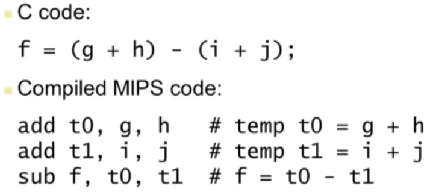

## 컴퓨터 하드웨어의 피연산자

### 레지스터 피연산자

- 산술 연산은 레지스터 피연산자를 사용
- MIPS는 32 X 32-BIT 레지스터 파일을 지님
  - 자주 사용하는 데이터에 사용
  - 0 ~ 31의 번호를 지님
  - 32bit / 4byte 데이터는 word 라고 부름

- 어셈블리
  - t 레지스터 
    - 임시 값 저장에 사용
  - s 레지스터
    - 변수 저장에 사용

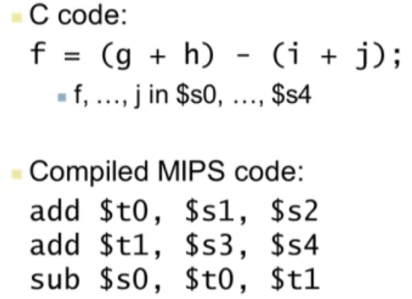

**디자인 법칙2**

- 작을수록 빠르다

## Byte 주소

- 컴퓨터의 기본 단위 - bit 

- 1-byte = 8-bit

- Alignment restriction
  - 명령어의 4-byte 배수 제한
  - 메모리 주소는 word 단위로 맞춰짐

- Endian
  - 데이터를 word 안에 저장하는 방식
  - Big Endian
    - 가장 왼쪽의 byte가 word 주소
    - 왼쪽부터 오름차순
    - IBM 360/370, Motorola 68K, **MIPS**, Sparc, HP PA 등
  - Little Endian
    - 가장 오른쪽의 byte가 주소
    - 오른쪽부터 오름차순
    - Intel 80x86, DEC Vax, DEC Alpha (Windows NT)

## 메모리 피연산자

- 주 기억장치의 복합 데이터에 사용
  - Arrays, structures, dynamic data
- 산술 연산을 적용하기 위해
  - 메모리에서 레지스터로 데이터 로딩
  - 연산 결과를 레지스터에서 메모리로 저장
- 메모리는 byte 단위로 접근
  - 각각의 주소는 8-bit byte로 구성
- Word 단위로 메모리에 정렬
  - 주소는 4의 제곱수로 구성

- MIPS는 Big Endian
  - 최상위 바이트가 word의 least address에 저장

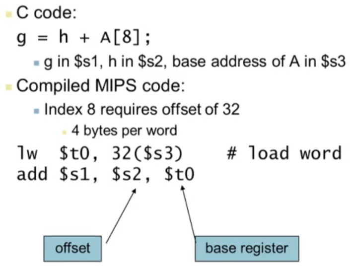

-----

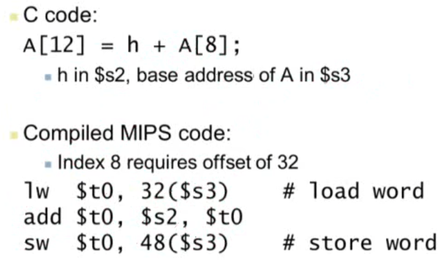

## 레지스터 vs 메모리

- 레지스터가 접근하는 시간이 훨씬 빠름
- 메모리 데이터의 동작은 로딩과 저장을 요구함
  - 더 많은 명령어가 실행되어야 함
- 컴파일러는 변수를 위한 레지스터를 최대한 사용해야함
  - 메모리에 접근하는 횟수가 감소
  - **레지스터 최적화**는 매우 중요

## MIPS 레지스터 파일

- 32-bit 레지스터를 지님
  - 2개의 read 포트와 1개의 write port

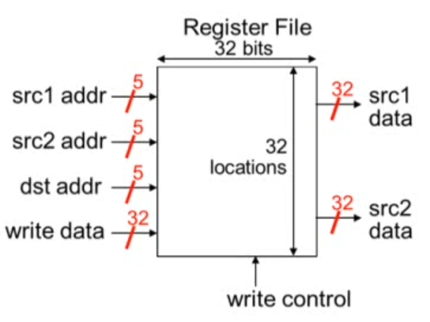

## MIPS 레지스터

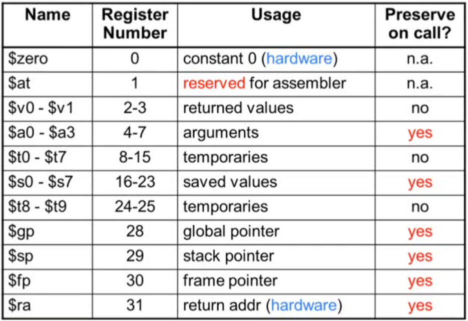

- $zero
  - 하드웨어
  - 항상 0
  - 읽기만 가능, 쓰기 불가능
  - MIPS에서 자주 사용
  - 값을 복사하고 싶은 경우 사용
- $at 
  - 어셈블러만 사용, 프로그래머는 사용 x
- $a
  - 함수 호출시 사용
- $v
  - return 값 저장시 사용

## 즉시 피연산자

- 연산에서 하나의 값이 상수 값을 갖는 경우
- 뺄셈은 지원하지 않음
- addi

​	**디자인 법칙3**

- 자주 사용하는 것을 빠르게 만들어라
  - 작은 상수 (-1, 0, 1) 등은 자주 사용됨
  - 로드 명령어의 수를 줄여줌

## signed and unsigned number

#### 2의 보수 방식

- 컴퓨터는 2진수를 사용하여 수를 표현

- 32비트까지 사용

- \|음수의 최소값\| = \|양수의 최대값\| + 1 
- 31번 비트는 sign 비트
  - 1이면 항상 음수
  - 0이면 양수 또는 음수

#### Singed Negation

- 부호 교체

- 각 비트를 1 -> 0, 0 ->1로 변경(보수) 후 1을 더해줌

#### Sign Extension

- 비트 수를 확장하는 것

- addi
  - 상수값을 더해줄 때 extension 발생
- lb (load byte), lh (load halfword)
  - 바이트, halfword 더할 때 extension 발생
- beq, bne
  - 이동 시 extension 발생
- sign 비트를 왼쪽에서부터 확장

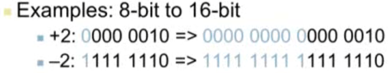

## 컴퓨터의 명령어 표현방식

- 모든 명령어는 2진법으로 표현
  - 기계어
- MIPS 명령어
  - 32비트 명령 word
  - op code (operation code) 수가 적음
  - 규칙적임

**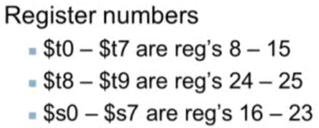**

### MIPS R-format 명령어

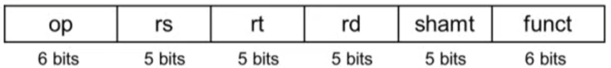

- op : operation code
- rs : source register
- rt : target register
- rd : desination register
- shamt : shift amount
- funct : function code

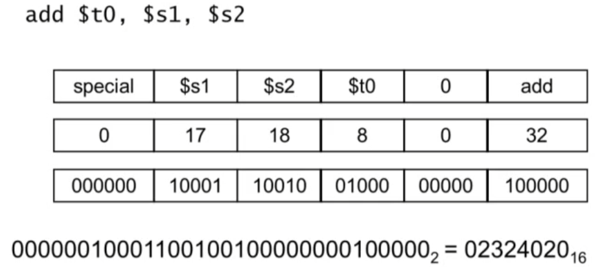

### Hexadecimal

- 16진수

- 사람이 이해하기 편해서 사용
- 4비트씩 표현
- 0x로 시작

### MIPS I-format 명령어

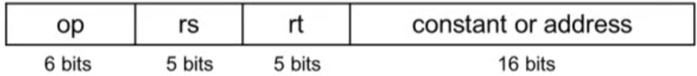

- Immediate-format
- 즉시 연산과 load/store 명령에 사용

**디자인 법칙4**

- 좋은 디자인은 좋은 절충안을 요구한다.
  - 복잡성을 낮추고 고성능을 얻을 수 있음

## 논리 연산

| Operation       | C    | Java | MIPS      |
| --------------- | ---- | ---- | --------- |
| **Shift left**  | <<   | <<   | sll       |
| **Shift right** | >>   | >>>  | srl       |
| **Bitwise AND** | &    | &    | and, andi |
| **Bitwise OR**  | \|   | \|   | or, ori   |
| **Bitwise NOT** | ~    | ~    | nor       |

### Shift 연산

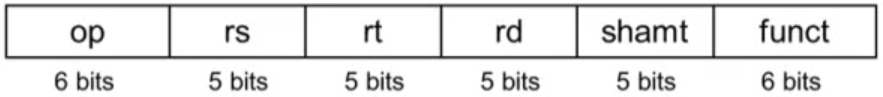

- shamt : shift 연산의 횟수

- Shift left logical
  - 왼쪽으로 shift하고 0을 채움
  - 2 ** i 만큼 곱한 효과
- Shift right logical
  - 오른쪽으로 shift하고 0을 채줌
  - 2 ** i 만큼 나눈 효과
  - unsigned 에서만 가능

### AND 연산

- 특정 비트 값을 추출할 때 사용
- 두 값이 모두 1이어야 1

### OR 연산

- 특정 비트 값을 1로 설정할 때 사용
- 두 값 중 하나라도 1 이면 1

### NOT 연산

- 0 -> 1, 1 -> 0 으로 변환

- MIPS에선 지원하지 않음
  - 피연산자를 3개 사용하는 **nor 연산**을 통해 구현

### 조건부 연산

- branch
  - 조건이 True면, 지시된 명령어를 수행
  - 조건이 False면, 다음 명령어를 수행
- beq rs, rt, L1
  - rs == rt면 L1 으로 이동
- bne rs, rt, L1
  - rs != rt면 L1으로 이동
- j L1
  - 조건에 상관없이 L1으로 이동

### if 구문

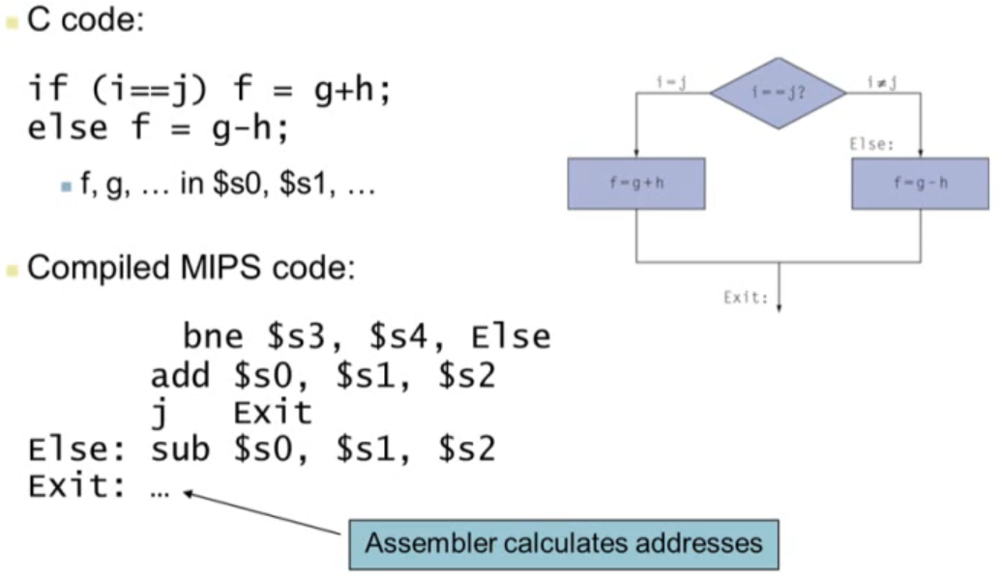

### Loop 구문

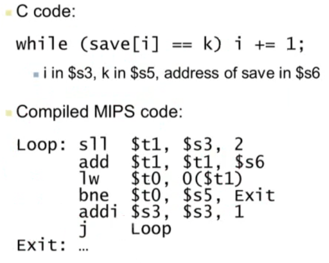

- sll $t1, $s3, 2
  - $s3를 좌로 2비트만큼 이동
- add $t1, $t1, $s6
  - save 주소의 시작값 $s6과 $t1을 더해 save[i]의 주소값 나옴
- lw t0, 0(t1) 
  - $t1에서 4바이트만큼 읽어서 $t0에 저장
- bne $t0, $s5, Exit 
  - $t0, $s5가 같지 않으면 Exit
  - 같으면 addi

## 기초 블록

- 연속된 명령어 집합
  - 마지막을 제외하고 branch 관련 명령어가 없어야 함
  - 처음을 제외하고 branch target이 없어야 함
- 컴파일러
  - 기초 블록을 찾아 빠르게 실행
- 프로세서
  - 기초 블록의 실행을 가속화

### 추가적인 조건부 연산

- 조건이 참이면 1, 거짓이면 0

- slt rd, rs, rt
  - rs < rt면 rd = 1, 아니면 rd = 0
- slti rt, rs, constant
  - rs < constant면 rt = 1, 아니면 rt = 0
- beq, bne 조합
  - slt $t0, $s1, $s2
  - bne $t0, $zero, L
    - $s1 < $s2면 $t0 =1 이 되고, $zero와 다르므로 L을 실행

# 함수의 실행 단계

> caller : 함수를 호출하는 것
>
> callee : 호출된 함수

1. caller가 callee가 접근할 수 있는 곳에 argument 배치
   - $a0 ~ $a3 : argument를 저장하는 4개의 레지스터
2. caller가 callee에게 컨트롤을 넘김
3. callee가 필요한 메모리 공간을 할당받음
4. callee가 해야할 일을 수행
5. callee가 일을 마친 후 caller가 접근할 수 있는 위치에 return 값 저장
   - $v0 ~ $v1 : return value를 저장하는 2개의 레지스터
6. callee가 caller에게 컨트롤을 넘겨줌
   - callee가 caller에게 컨트롤을 넘길 때 return 주소를 알고 있어야 함
   - $ra : return 주소를 저장하는데 사용되는 레지스터

#### 레지스터 용도

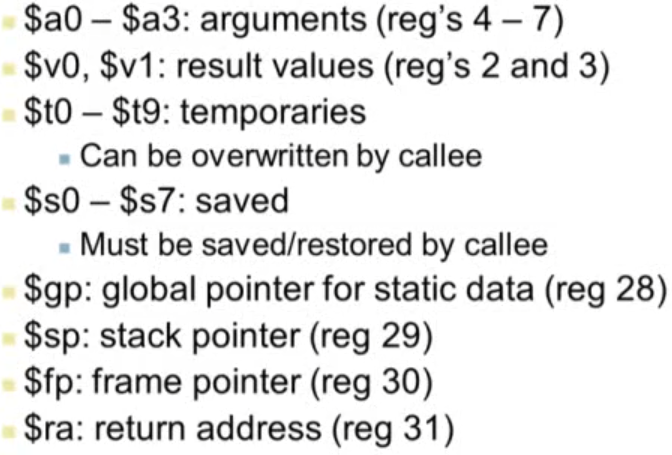

## 절차 호출 명령

- 점프와 연결
- **jal ProcedureLabel**
  - 다음 명령어 주소를 $ra에 저장
  - 타겟 주소로 점프
  - caller로 가는 명령어
- **Procedure return: jump register**
  - jr $ra
    - $ra 값을 프로그램 카운터(현재 실행하고 있는 명령어의 메모리 주소를 지닌 레지스터)에 복사
    - callee로 가는 명령어

### leaf procedure

- 프로그램 최하위에 있으면서 어느 프로시저도 호출하지 않는 프로시저

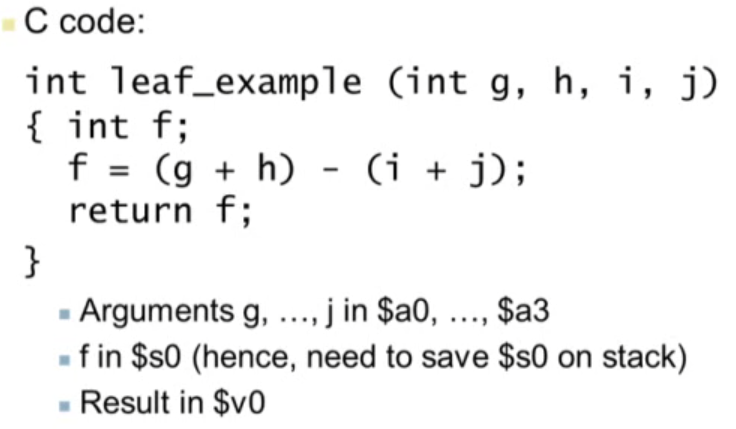

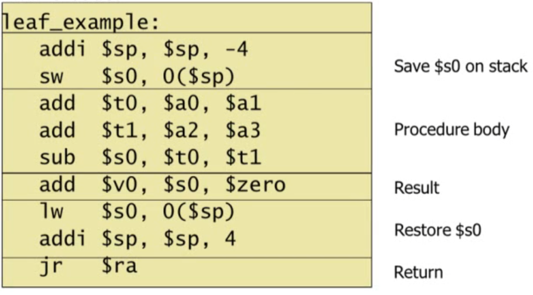
