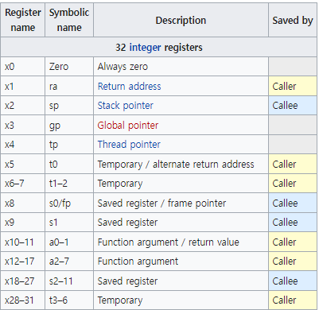
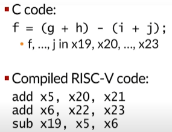
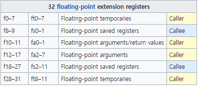
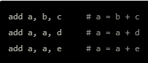
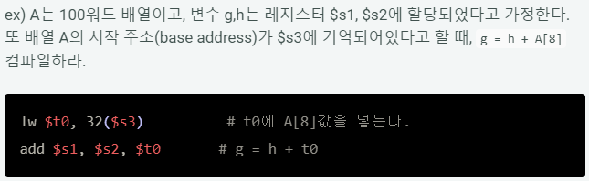

# Instruction Set Architecture (ISA)

- 마이크로 프로세서가 인식해서 기능을 이해하고 실행할 수 있는 명령어 집합 구조
  - 자료형, 명령어, 레지스터, 어드레싱 모드, 메모리 구조, 인터럽트, 예외 처리, 외부 입출력 등
- 소트프웨어와 하드웨어 사이의 중재자 역할

- 명령어
  - 실행코드 (opcode)
  - 피연산자 (operand)
- 어셈블리와 1:1 대응

### 개요

- 성능 / 에너지와는 무관
- 소프트웨어 개발 / 스택과 연관
- 무료 공개된 ISA에 대한 표준 필요

### 대표적인 ISA들

- x86 ISA

  - 너무 복잡한 명령어 세트
  - 유료

- ARM ISA

  - 보다 간단한 명령어 세트
  - 유료

- RISC-V ISA

  - 미국 UC 버클리에서 개발중인 무료 오픈 소스 명령어셋 아키텍쳐

  - 다른 상업적인 ISA보다 간단함
  - 스마트폰이나 임베디드 장치의 CPU로 널리 쓰이는 ARM과 경쟁하고 대체할 수 있는 고성능의 자유 CPU 구조를 개발하는 것이 목표
  - 연구 / 교육/ 상업적 목적으로 설계됨

### 4개의 정수 ISA

- RV32E, RV32I, RV64I, RV128I

### 표준 익스텐션

- M : 정수 곱/ 나눗셈
- A : atomic memory operations
- F : 단일-정밀도 부동소수점
- D : 배수-정밀도 부동소수점
- G = IMAFD, '범용' ISA
- Q : 4배수정밀도 부동소수점

## RISC-V ISA

- 산술 명령어는 레지스터 피연산자를 사용

- 32 x 64비트 레지스터 파일
  - 자주 접근하는 데이터에 사용
  - 64비트 데이터는 '더블워드 (doubleword)'
  - 32비트 데이터는 '워드 (word)'

 

#### 레지스터 (프로세서 레지스터)

- 컴퓨터의 프로세서 내에서 자료를 보관하는 아주 빠른 저장소
- 메모리의 최상의 계층
- 데이터에 가장 빠르게 접근 가능
- Design Principle 2 : Smaller is faster
  - 적은 양의 레지스터에서 더 빠르게 값을 찾을 수 있다.

#### Register sets

- 32개의 정수 레지스터

- 32개의 부동소숫점 확장 레지스터

  

### MIPS 산술 명령어

- 반드시 한 종류의 연산만 지시
- 항상 변수 세 개를 갖는 형식
- ex) b, c, d, e의 합을 a에 넣기

- 한 줄에 명령어 하나만 쓸 수 있음

- 줄이 끝나면 주석도 끝남

  

### 메모리 피연산자

- MIPS의 산술연산은 레지스터에서만 실행되기 때문에 메모리와 레지스터 간에 데이터를 주고 받는 **데이터 전송 명령어 (data transfer instruction)**가 필요함
- 메모리에서 레지스터로 데이터를 복사해 오는 명령을 적재 **(load, load word)**라고 함

- 데이터 전송