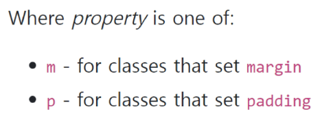
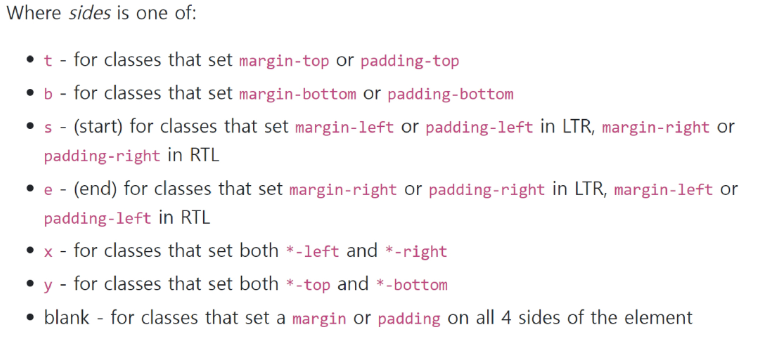
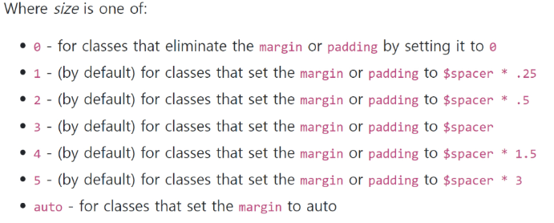
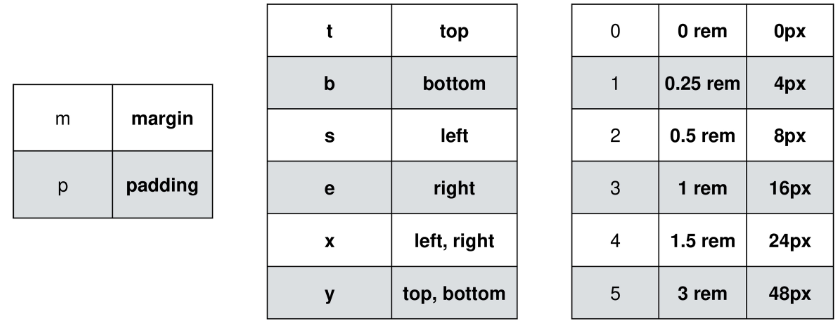

# CDN

- Content Delivery(Distribution) Network

- 컨텐츠를 효율적으로 전달하기 위해 여러 노드에 가진 네트워크에 데이터를 제공하는 시스템


# Bootstrap

## 기본 원리

### spacing (Margin and padding)

```html
<div class="mt-3 ms-5">bootstrap-spacing</div>
```











