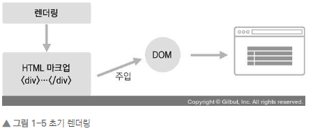
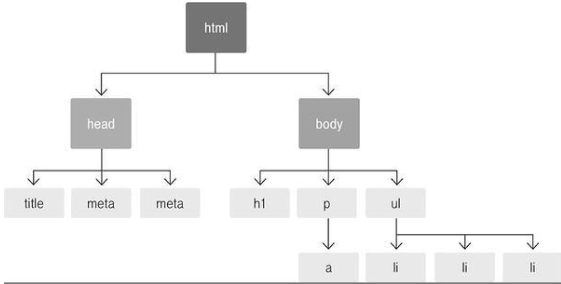

# 시작

## 리액트 이해

- **오직 V(View)만 신경 쓰는 라이브러리**

## 1 - 1. 초기 렌더링

- render() { ... }
  - 컴포넌트가 어떻게 생겼는지 정의
  - html 형식의 문자열 반환 x
  - 뷰가 어떻게 생겼고 어떻게 작동하는지에 대한 정보를 지닌 객체 반환

- 컴포넌트 내부에는 다른 컴포넌트 삽입 가능
  - render 함수 실행 시 내부에 있는 컴포넌트 재귀적으로 렌더링

- 최상위 컴포넌트 렌더링 작업 종료 => 정보 사용하여 HTML 마크업 생성 => DOM 요소 안 주입

## 1 - 2. 조화 과정

- render 함수
  - 컴포넌트 업데이트
  - 새로운 데이터로 render 함수 재호출
  - 새로운 뷰 생성
  - 곧바로 DOM에 반영하지 않고 이전의 컴포넌트 정보와 비교

## 2 - 1. DOM이란? 

- Document Object Model
  - 객체로 문서 구조를 표현하는 방법
  - XML / HTML로 작성
  - 기본적으로 정적

## 2 - 2. Virtual DOM

- DOM 업데이트를 추상화하고 DOM 처리 횟수를 최소화하여 효율적으로 진행하여 개선

1. 데이터 업데이트시 전체 UI를 Virtual DOM에 리렌더링
2. 이전 Virtual DOM과 내용 비교
3. 바뀐 부분만 실제 DOM에 적용

## 2 - 3. 기타 특징

- 프레임워크가 아닌 **라이브러리**
- 뷰를 제외한 기타 기능은 직접 구현해야 하나,
- 라우팅
  - 리액트 라우터 (react-router)

- Ajax 처리
  - axios / fetch
- 상태 관리
  - 리덕스 (redux) / Mobx

- 타 라이브러리 / 프레임워크와 혼용 가능