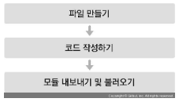

# Component

## 1. 클래스형 컴포넌트

```javascript
import React, { Component } from 'react';

class App extends Component {
    render() {
        const name = 'react';
        return <div className = "react">{name}</div>;
    }
}

export default App;
```

- **render 함수**가 필수
  - 안에서 보여 주어야 할 JSX 반환


## 2. 함수형 컴포넌트

### 장점

- 선언하기 간편함

- 메모리 자원 사용이 적음

- 결과물의 파일 크기가 작음

  

### 단점

- state와 라이프사이클 API 사용 불가
  - 리액트 v16.8 업데이트 후 Hooks 기능이 도입되며 해결


### 일반 함수 vs 화살표 함수

#### 일반 함수 

- 자신이 종속된 객체를 this로 가리킴

#### 화살표 함수

- 자신이 종속된 인스터스를 this로 가리킴


## 3. 모듈 내보내기 및 불러오기

### 모듈 내보내기 (export)

```javascript
export default MyComponent;
```

- 다른 파일에서 이 파일을 import 할 때, MyComponent 클래스를 불러오도록 설정


### 모듈 불러오기 (import)

```javascript
import MyComponent from './MyComponent';
```


## 4. 컴포넌트 생성



### props

- properties
  - 컴포넌트 속성을 설정하는 요소
  - 부모 컴포넌트에서 설정 가능
- 